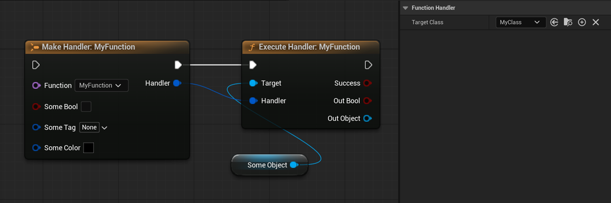
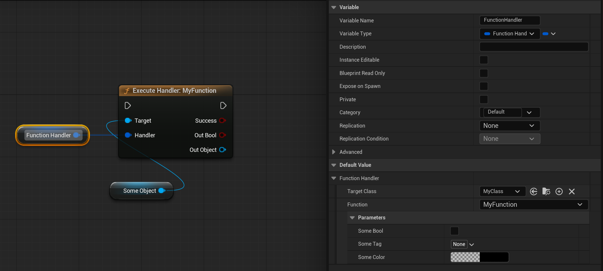
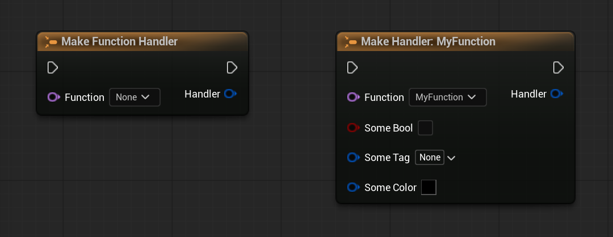
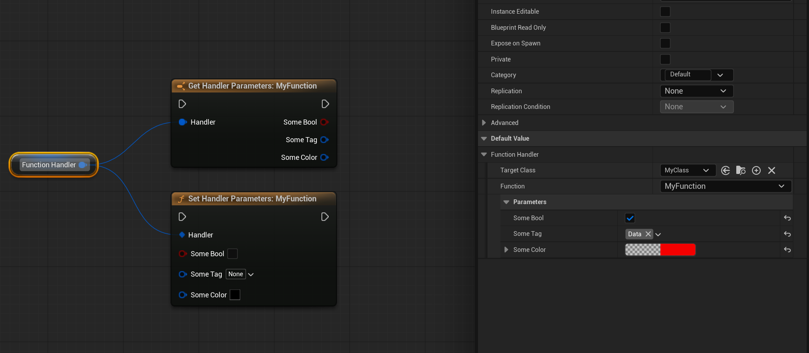
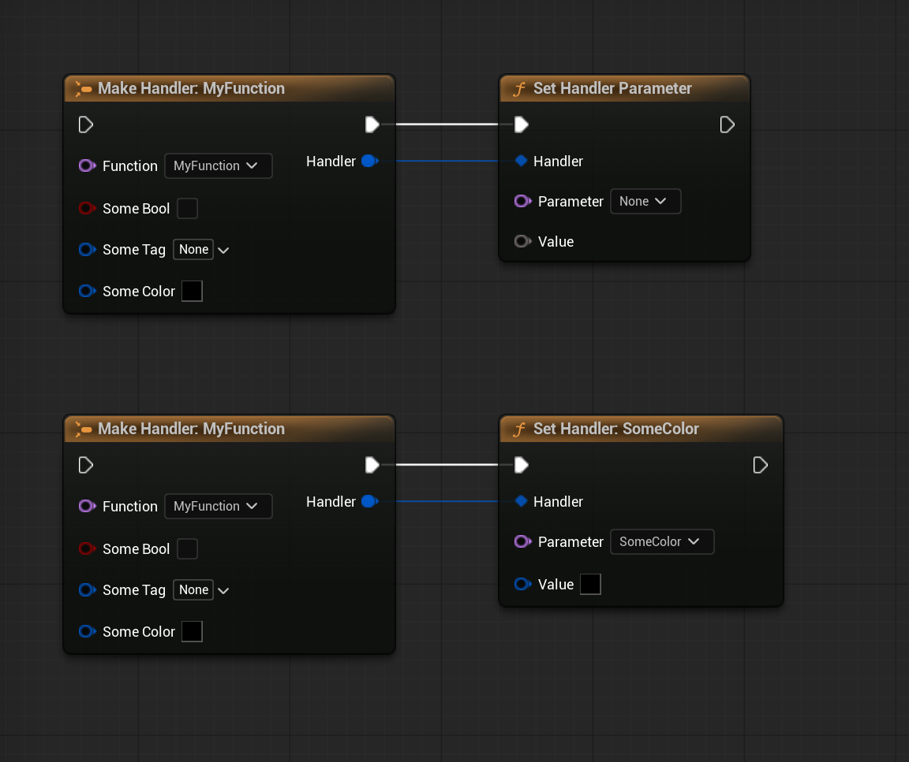
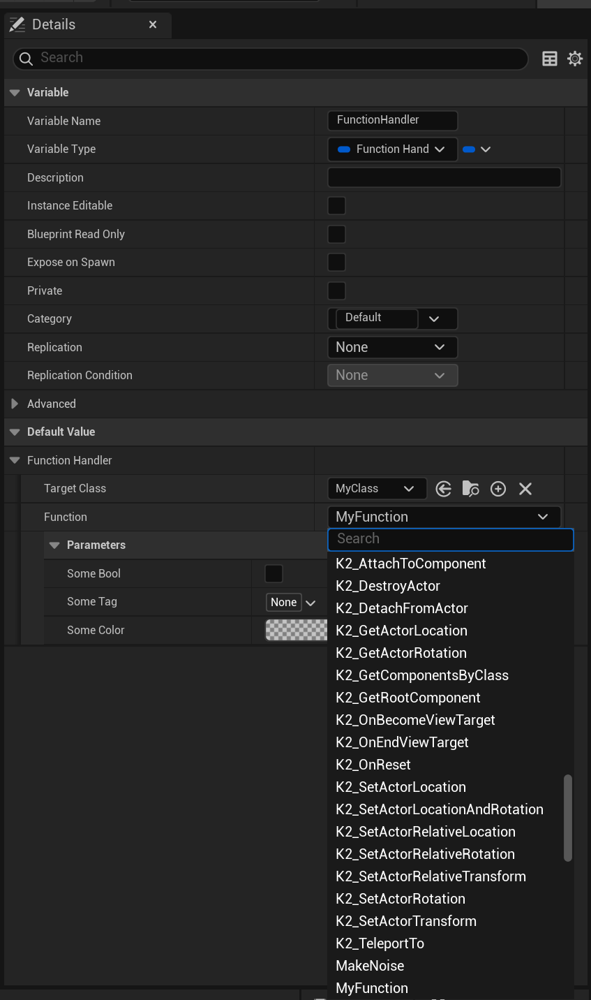

# FunctionHandler

**English** | [Русский](README.ru.md)

A serializable, data-driven function call system for Unreal Engine 5. Configure function calls in the editor with full parameter editing, execute them at runtime via `ProcessEvent`.



## Overview

**FunctionHandler** wraps a `UFunction` reference with stored parameter values into a single, serializable struct (`FFunctionHandler`). Instead of hardcoding function calls or wiring dozens of Blueprint nodes, you define *what* to call and *with what parameters* as data, then execute it whenever and wherever you need.

**Key features:**
- Serializable `FFunctionHandler` struct. Works with SaveGame, replication, data assets
- Full property editors in Details panel (GameplayTag pickers, asset selectors, color pickers, etc.)
- Custom K2 Nodes: **Execute Handler**, **Make Handler**, **Set/Get Handler Parameters**
- Typed return value / out parameter support via custom Blueprint VM thunks
- C++ template API: `UFunctionHandlerLibrary::SetParameter<T>()`
- Zero runtime dependencies on editor modules

## Installation

Download the pre-built plugin for UE 5.6 from [Releases](https://github.com/PsinaDev/FunctionHandler/releases/) or clone/download the source code. Place the plugin into your project's `Plugins/` directory, regenerate project files, and enable the plugin in `.uproject` or via Edit > Plugins.

**Modules:**

| Module | Type | Purpose |
|--------|------|---------|
| `FunctionHandler` | Runtime | Core struct, library, VM thunks |
| `FunctionHandlerEditor` | Editor | Property customization |
| `FunctionHandlerUncooked` | UncookedOnly | K2 Nodes, graph pin widgets |

## Quick Start

### Blueprint: Variable Workflow

1. Add a `FFunctionHandler` variable to your Blueprint
2. In the Details panel, select **Target Class** and **Function**
3. Configure parameters with native property editors
4. Use **Execute Function by Handler** or **Execute Handler** node at runtime



### Blueprint: Make Handler Workflow

1. Place a **Make Function Handler** node
2. Select Target Class in node details, pick a function from the dropdown
3. Wire typed parameter inputs
4. Connect output to **Execute Handler** for typed return values



### Blueprint: Set / Get Handler Parameters

Use **Set Handler Parameters** to batch-write all parameter values on an existing handler, and **Get Handler Parameters** to batch-read them back. Both with fully typed pins.



### Blueprint: Set Single Parameter

1. Place a **Set Handler Parameter** node
2. Connect a Handler variable or Make node
3. Select parameter from the dropdown. Value pin automatically resolves to the correct type



### C++

```cpp
#include "FunctionHandlerTypes.h"
#include "FunctionHandlerLibrary.h"

// Create a handler
FFunctionHandler Handler;
Handler.TargetClass = UAbilityComponent::StaticClass();
Handler.FunctionName = TEXT("AddState");

// Set parameters (type-safe)
FGameplayTag Tag = FGameplayTag::RequestGameplayTag(TEXT("State.Active"));
UFunctionHandlerLibrary::SetParameter(Handler, TEXT("State"), Tag);

// Execute on a target
UFunctionHandlerLibrary::ExecuteFunctionByHandler(MyAbilityComponent, Handler);
```

## Details Panel

The property customization provides a complete editing experience:

- **Target Class** picker with standard class selector
- **Function** dropdown with search (filters delegates, internal functions)
- **Parameter editors** with native UE property widgets for every parameter type
- Hidden parameters (return value, pure out) are automatically filtered



## K2 Nodes

### Execute Function Handler

Executes a handler on a target object. Automatically generates **typed output pins** for return values and out parameters based on the connected handler's function signature.

**Features:**
- Resolves function signature from connected variable (via CDO) or Make node
- Typed return value and out-parameter pins
- Reacts to Blueprint compilation, variable changes, and pin connections
- Orange tint for visual distinction

### Make Function Handler

Creates a `FFunctionHandler` struct inline with typed input pins for each function parameter.

**Features:**
- Target Class in node details
- Function dropdown with search directly on the node
- Typed input pins generated from function signature
- Chains with Execute Handler for end-to-end typed workflow

### Set Handler Parameters

Batch-writes all parameter values on an existing handler with typed input pins. Resolves function signature from the connected handler, generates one input pin per parameter.

**Features:**
- Typed input pins for every function parameter
- Works with variable-based and Make-based handlers
- Only writes parameters that have a connection or non-empty default

### Get Handler Parameters

Batch-reads all stored parameter values from a handler into typed output pins. The inverse of Set Handler Parameters.

**Features:**
- Typed output pins for every function parameter
- Only evaluates outputs that are actually connected
- Useful for inspecting or forwarding handler state

### Set Handler Parameter

Sets a single parameter on an existing handler with a type-safe value pin.

**Features:**
- Parameter dropdown on the node (populated from connected handler's function)
- Wildcard Value pin resolves to the selected parameter's type
- Works with both variable-based and Make-based handlers

## Architecture

```
FFunctionHandler (USTRUCT)
├── TargetClass: TSubclassOf<UObject>
├── FunctionName: FName
├── ParameterValues: TMap<FName, FString>    // ExportText/ImportText serialization
├── ResolveFunction(UObject*) -> UFunction*
└── ResolveFunctionFromClass() -> UFunction*

UFunctionHandlerLibrary (UCLASS)
├── ExecuteFunctionByHandler()               // Simple fire-and-forget
├── SetParameter<T>()                        // C++ template setter
├── InternalExecuteWithResult()              // Returns UFunctionCallResult*
├── GetResultByName()                        // CustomThunk, typed output
├── InternalSetParameter()                   // CustomThunk, typed input
├── InternalGetParameter()                   // CustomThunk, typed output from TMap
└── InternalMakeFunctionHandler()            // Struct construction

UFunctionCallResult (UCLASS, Transient)
├── ResultData: TSharedPtr<FStructOnScope>   // Owns the parameter buffer
├── CachedFunction: TWeakObjectPtr<UFunction>
└── GetBuffer() -> uint8*
```

### How It Works

1. **In the editor:** Property customization creates `FStructOnScope(UFunction*)`, imports stored values, and displays them via `IStructureDetailsView`. Changes export back to `TMap<FName, FString>`.

2. **At compile time:** K2 Nodes expand into chains of `InternalMakeFunctionHandler` > `InternalSetParameter` > `InternalExecuteWithResult` > `GetResultByName` calls. CustomThunks use `FProperty::ExportTextItem_Direct` / `ImportText_Direct` for type-safe conversion.

3. **At runtime:** `ExecuteFunctionByHandler` allocates a parameter frame (`FMemory::Malloc` + `InitializeStruct`), imports values from TMap via `ImportText_Direct`, calls `ProcessEvent`, and cleans up.

### CustomThunk Implementation

The plugin uses UE's Blueprint VM `CustomThunk` mechanism for type-safe wildcard parameters:

- **`GetResultByName`** reads from `UFunctionCallResult` buffer using `FProperty::CopySingleValue`
- **`InternalSetParameter`** exports typed value via `FProperty::ExportTextItem_Direct` into the handler's TMap
- **`InternalGetParameter`** imports stored text from the handler's TMap back into a typed output via `FProperty::ImportText_Direct`

All follow the engine's `StepCompiledIn<FProperty>` pattern with explicit `MostRecentProperty` reset to avoid stale VM state.

## Requirements

- Unreal Engine 5.6+
- C++17

## License

MIT
